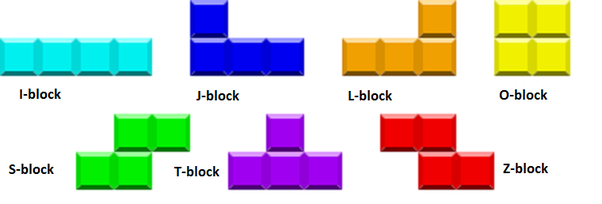
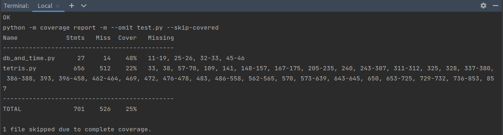

# Tetris-Python

Tetris game!, made with Python :snake: and love :heart:.

<p align="left" style="width: 70%">

</p>

## Prerequisites

* It is recommended to create and activate a Python virtual environment
* Install the requirements libraries with:

  ```bash
  make requirements (mingw32-make requirements)
  ```

## Run

```bash
make run (mingw32-make run)
```


### Controls

* ↑ Turn the piece
* → Go right
* ← Go left
* ↓ Fall faster

## Resources

### Sound Source

* [game over.wav](https://freesound.org/people/irrlicht/sounds/42349/)  
* [Menu Interface - Confirm 003.wav](https://freesound.org/people/DWOBoyle/sounds/143607/)  
* [Pop sound](https://freesound.org/people/deraj/sounds/202230/)  
* [In game](https://freesound.org/people/BloodPixelHero/sounds/580898/)

## Code style

We use [ruff](https://beta.ruff.rs/docs/) as a linter, to format the code.

You can run the check with:

```bash
make style (mingw32-make style)
```

## Tests

To run the Test Suite, you could run the next command:

```bash
make test (mingw32-make test)
```

To see a Coverage Report, you could run the next command:

```bash
make coverage
```

## Technical Details



Each block have an associated name, and is represented with a Class.

## To Do

* [X] Function and Argument names should be lowercase, with words separated by underscores as necessary 
  to improve readability (snake-case).
* [X] Max line length should be 120 characters, fix the lines that are longer than that.
* [X] Add type hints to the functions, see [ref](https://docs.python.org/3/library/typing.html), 
  this is a good way to document the code defining the parameters types and the return type.
* [X] Add docstrings to the functions, see [ref](https://www.python.org/dev/peps/pep-0257/), 
  in order to document the code.
* [X] Reduce the use of global variables, and use the parameters or attributes instead. 
  And if is really necessary to use global variables, define them in uppercase, and in the beginning of the file.
* [X] Create a main function, and move the code that is in the global scope to this function, 
  and call it at the end of the file.

  ```python
  def main():
      # Code here, instead of the global scope
      pass
  
  if __name__ == "__main__":
      main()
  ```
* [X] Instead of using block numbers to identify the different block shapes, you could create a class for each 
  piece shape, that inherits from a base class. Something like:
   
  ```python
  class Block:
      # Base class for the blocks
      pass
  
  class BlockI(Block):
      # Class for the I block, with the specific methods for this block
      def start(self): 
        pass 

      def turn(self): 
        pass 
  
  class BlockJ(Block):
      # Class for the J block, with the specific methods for this block
      def start(self): 
        pass 

      def turn(self): 
        pass 
  ```
* [X] Create unit tests for the functions, see [unittest](https://docs.python.org/3/library/unittest.html), 
  or the alternative [pytest](https://docs.pytest.org/en/7.4.x/).
* [X] Reorganize the code in different files, for example, you could create a file for the utils functions, 
  another for the Block classes, and another for the main function.
* [X] The DB management could be defined in a class, to encapsulate the logic.
* [X] The time tracking could be defined in a class, to encapsulate the logic.
* [X] Send to [settings.py](settings.py) the configs constant variables, maybe like the screen size, the colors, etc.
* [X] Check the different [rules for the linter](https://beta.ruff.rs/docs//rules/), and add the ones that you 
  consider necessary to the [configuration file](pyproject.toml).
* [ ] Subdivide the [db_and_time.py](db_and_time.py) file in two files, one for the DB management, and another for 
  the time tracking.
* [ ] Maybe a `Block` must not inherit from a `Tetris`, in order to decrease the dependency between those classes.
* [ ] Exist the Class `BackgroundBlock` and the function `color_the_block`, 
      maybe those elements are related and is better to be together in the same class?
      The idea is relate the "same things", and unrelate the "things that are different".
* [ ] Maybe rename the `Block` classes, to a little more representative name as: `BlockO`, `BlockL`, etc. 
      Taking into account the different block type defined in [#technical-details](#technical-details).
* [ ] Increase the code coverage  of the test suite, you could run `make coverage` 
      and see which lines are not covered by the test suite:
      

## License

This project is licensed under the _GNU General Public Licence_ - see the [LICENSE](LICENSE) file for details.
